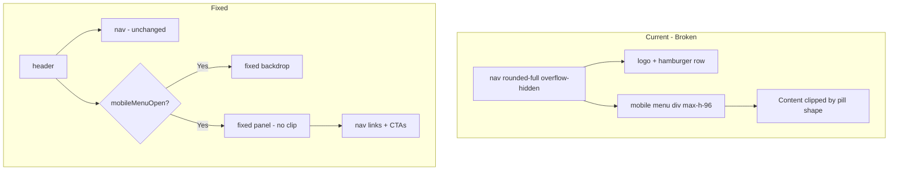

# Fix Mobile Navigation UX/UI

## Problem

The mobile menu is rendered **inside** the `<nav>` element which has:

- `rounded-full` — creates a pill/capsule shape
- `overflow-hidden` — clips all child content to that shape

When the menu expands via `max-h-96`, it gets clipped by the pill's curved edges, cutting off "Docs", "Pricing", and the CTA buttons. This produces the circular mask effect shown in the screenshot.

## Solution

Replace the inline dropdown with a **full-viewport overlay** pattern—the standard approach for mobile hamburger menus. The overlay will:

- Render as a sibling (outside the nav's overflow)
- Use a semi-transparent backdrop with blur
- Display a clean panel with proper rounded corners and no clipping
- Close on backdrop tap, link tap, or explicit close button

## Implementation

### 1. Restructure the mobile menu in [components/layout/public-nav.tsx](components/layout/public-nav.tsx)

**Current flow:**

```
nav (rounded-full + overflow-hidden)
  └── [logo row]
  └── mobile menu div (max-h-0 → max-h-96) ← CLIPPED by parent
```

**New flow:**

```
header
  ├── nav (unchanged, stays pill-shaped when closed)
  └── {mobileMenuOpen && <MobileMenuOverlay />}  ← Rendered outside nav
```

### 2. Create `MobileMenuOverlay` as a fixed overlay

- **Backdrop**: `fixed inset-0 z-[60]`, `bg-black/60 backdrop-blur-sm`, `onClick` closes menu
- **Panel**: Centered card or top-anchored panel with `mx-4 mt-4`, `rounded-2xl`, `glass-nav` or `bg-background` for consistency, `border border-border`
- **Content**: Nav links (from `navLinks`), Sign In + Start for free CTAs
- **Close**: X button (use `X` from lucide-react) in top-right of panel; hamburger icon toggles to X when open (optional UX enhancement)
- **Accessibility**: `aria-modal="true"`, focus trap (or at minimum ensure close is focusable), `aria-label` on overlay
- **Body scroll lock**: Add `overflow-hidden` to `body` when open, remove when closed (prevents background scroll)

### 3. Optional UX polish

- **Hamburger → X animation**: Toggle `Menu` icon to `X` when `mobileMenuOpen` for clear affordance
- **Panel animation**: Fade-in + subtle slide-down using Tailwind `animate-in` / `animate-out` (if available) or transition classes
- **Link spacing**: Adequate `py-3` or `py-4` for touch targets (min 44px)

### 4. Remove the inline mobile menu block

Delete the existing mobile menu `div` (lines 92–139) that expands inside the nav.

## File Changes


| File                                                                 | Changes                                                                                                  |
| -------------------------------------------------------------------- | -------------------------------------------------------------------------------------------------------- |
| [components/layout/public-nav.tsx](components/layout/public-nav.tsx) | Extract mobile menu to overlay component; remove inline expanding div; add overlay with backdrop + panel |


## Structure Sketch




## No New Dependencies

Implementation uses existing primitives (fixed positioning, Tailwind, Lucide icons). No need for Sheet/Drawer component unless you prefer a slide-from-side variant—the overlay approach is simpler and sufficient.